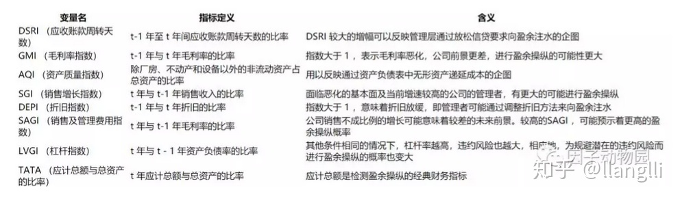

# <center>  因子动物园学习笔记

**《Your Complete Guide to Factor-Based Investing》中的因子检验6大标准：**
>Persistence，持久性，即因子有效性长期存在，即使被公开发表。
Pervasiveness，普适性，在不同的证券类别和国家广泛存在。
Robustness，稳健性，定义可以多样化，对参数不敏感。
Intuitiveness，逻辑性，即要有合理的逻辑，无论是从风险视角，还是行为金融视角。
Investability，可投资性，收益不能只停留在论文里，操作不能复杂，交易成本可控。
Information Increasement，差异性，即必须要有信息增量，不能被已有的其他因子解释。

**学术上解释因子收益来源角度：**

+ risk-based 从经典金融学的角度，认为一个异象如果能获得超额收益，肯定是承担了某种讨厌的风险，超额收益是这种风险的补偿；

+ mispricing 从行为金融学的角度，认为要么是某种限制阻碍了异象的消失，要么是投资者认知偏差导致的行为不理性。

**因子分类：**

+ **宏观经济因子**，包括消费增长、通胀、债券利差等等。

+ **基本面因子**，包括估值、经营效率、盈利能力、财务风险、破产风险及流动性风险。当然，流动性风险也部分低与交易和量价特征有关。

+ **技术类因子（量价类因子）**，包括动量、反转、波动率、beta 等相关因子。

+ **另类因子**，包含分析师预期因子、ESG 因子（环境、社会责任与公司治理因子）、文本情绪因子（新闻情绪、研报情绪、管理层情绪等）等。 

## 一、低风险因子

### 1.1 低风险异象（low-risk-anomaly）

>风险较小的股票未来收益较高，风险较大的股票未来收益反而低。

### 1.2 不同的低风险因子

 （1）简单波动率

**总波动率（Total Volatility）又称为简单波动率**，常常用过去T个交易日收益率的标准差进行估计。T越短，估计结果变动越剧烈，T越长，估计结果变动越平滑。

计算公式:

```math
TV_{i}=\sqrt{252}std(r_{i})=\frac{\sqrt{252}\times \sum_{t=1}^{T}(r_{it}-\bar{r_{i}})^{2}}{T-1}
```

$$
\bar{r_{i}}=\frac{\sum_{t=1}^{T}r_{it}}{T}
$$

 + 特质波动率
 + 特异度
 + 离散度
 + 累计振幅
 + 贝塔
 + 下行贝塔
 + 偏度
 + 协偏度
 + 特质偏度
 + 价格时滞
 + 系统风险变动因子
 + 最大收益率（MAX）
 + 尾部风险（Tai Risk）
 + 大盘相关性


## 二、基本面因子

### 2.1 基本面动量

为什么各种基本面因子常常跑不过最经典而基础的技术因子——价格动量？Huang.zhang,zhou,and zhu(2019)《Twin Momentum:Fundamental Trends Matter》解释了其中的原因：

+ 原因：主要是因为没有充分利用已知的全部基本面信息。

    1. 一方面，已有因子往往集中于单个基本面指标，如BM，或是最多一类指标，如value；
    2. 另一方面，这些因子往往只李永乐最近的信息，并未考虑基本面数据的变化趋势。
+ 通过综合多维度的基本面指标以及将基本面趋势纳入考量，构建基本面动量因子，能取得不错表现。
+ 如何构建

    1. 利用基本面变量的趋势来预测公司未来基本面，基本面趋势用基本面变量的移动平均来表示；
    2. 计算基本面隐含收益：用t期股票收益对t-1期基本面变量的不同期限的MA做截面回归，再用拟合系数和t期基本面数据MA，预测t+1期的股票收益。
    3. 选取的指标（ROE\ROA\每股盈利\基于应急项目的经营性利润比净资产\基于现金流的经营性利润比总资产、毛利润比总资产、净派息率）
+ 将价格动量和基本面动量做双重排序，得到25个股票组合，并做多价格动量和基本面动量都排名靠前的组合，做空二者排名都靠后的组合，据此构建双重动量因子。


## 三、技术因子

### 3.1 技术分析的价值

+ Han, Yang, and Zhou (2013) 研究表明，技术分析的价值，主要体现在基本面信息存在高度不确定性时。

+ 当基本面信息非常明朗时，投资者能有效地分析、处理信息，并据此进行投资决策，此时，基本面分析是有效的，但技术分析的作用就非常有限。

+ 反之，当基本面信息存在高度不确定性时，投资者将更依赖技术分析。特别地，投资者在不完全信息下，往往会对新信息反应不足，此时，依据技术分析进行趋势跟踪就变得有利可图。


## 四、动量因子

### 4.1 什么是动量

>动量效应是指股票间的相对强弱趋势会延续（“强者恒强，弱者越弱”）。过去一段时间表现较好的一组股票，在接下来的一段时间，仍将有更好的表现；过去一段时间表现较差的一组股票，未来仍将延续弱势。

### 4.2 动量的分类

+ 横截面动量
+ 时间序列动量（亦称为趋势）

### 4.3 如何构造动量组合

1. 在选股日，依据某个指标，对股票池中的股票排序，将全部股票分为 n 组；

2. 构造多空组合，做多排名前 m% 的股票组合，同时做空等额排名最后 m% 的股票组合；

3. 每日计算该多空组合的每日收益，结果即为当日的因子收益率；

4. 再平衡：在下一个选股日，依据最新的数据，重新选股，重构股票组合。

### 4.4 不同环境对动量表现的影响

（1）股票市场

+ 发达市场
+ 新兴市场
+ 前沿新兴市场

（2）不同行业

+ 思路1：研究行业动量，分析行业动量对个股动量的解释力

+ 思路2：对不同行业分别构造动量组合，比较不同行业的动量组合的表现。（依据动量组合和个股所属行业，计算不同行业对动量因子的贡献。）

（3）不同风格
（4）债券市场、大宗交易市场、外汇市场

### 4.5 解释动量的基本假说（也是解释投资异象的基本框架）

系统性风险溢价和投资者行为偏差都能部分解释动量效应，后者对动量效应的影响可能更加显著和持久。

#### （1）系统性风险定价假说

>系统性风险定价假说是指：动量效应的超额收益，来源于承担了某些系统性风险而获得的风险溢价。

主流解释有：

##### 1. 动态风险敞口和动态崩溃效应

+ **动态风险敞口假说** 是指：赢家组合和输家组合有着不同的、时变的系统性风险暴露，因此（多空）动量组合有着时变的系统性风险敞口，需要获得风险溢价补偿。

+ **动量崩溃（Momentum Crash）** 是指：动量策略会遭遇不多但持续时间长、幅度大的下跌，即崩盘，它与动量策略的尾部风险有关。基于如此巨大的尾部风险，动量策略理应获得更高的回报以弥补风险。

##### 2. 经济周期

+ 不同因子或策略在不同经济周期或市场环境下，往往有着不同的表现。


##### 3. 宏观风险因子暴露

+ 赢家组合相对输家组合对产出增长率因子等宏观因子有着更高的短期暴露。

#### （2）投资者行为偏差

>投资者行为偏差假说是指：动量效应的优异表现，起源于对投资者行为偏差导致的错误定价的利用和纠正。（行为金融学的应用研究）

主流解释：

##### 1. 过度自信与反应不足

+ 投资者对其私有信息的过度自信和有偏的业绩归因，会导致对市场新信息的反应不足，从而导致股票收益率短中期正自相关（动量），和长期的负相关（反转）。

##### 2. 前景理论和处置效应

+ 心理账户导致处置效应（投资者倾向于止损小幅度亏损的股票，并持有大幅亏损的股票），从而助长了追涨杀跌的行为，拉大了股票价格与其基本面之间存在的差异，进而导致了动量效应，若控制了未实现资本利得，则动量效应不再显著。

##### 3. 推定预期偏差

+ 即投资者将过去的数据（收益率、盈利等）外推，作为对未来的预期。

##### 4. 知情交易

+ 知情交易股票间的动量效应，显著强于非知情交易股票

##### 5. 市场情绪

+ 动量超额收益只在市场情绪乐观时存在；

+ 市场情绪高涨之时，空头组合会表现更好，而多头组合并不受显著的影响；


##### 6. 过度相关性

+ 收益序列的中期负相关性是动量的主要来源；

+ 动量效应主要来源于反应不足的行为偏差导致的收益率自相关性。

### 4.6 动量的扩展

+ 残差动量

+ 尾部风险调整动量

+ 文化对动量的影响

+ 新闻动量

### 4.7 动量与其他因子的结合

通过结合动量与其他因子，来构建具有更优风险调整后回报的因子\投资策略。既可以是配置不同的因子，也可以是在筛选过程中有机结合不同的因子。（动量因子与其余因子之间的交互效应）

#### （1）动量与反转
动量与反转是争锋相对的，但是两者的作用区间不同：通常，在短期（6个月以内，尤其是3个月以内）和长期（3年以上），反转效应更为显著；中期（6个月至3年），动态效应更为显著。
+ Han,Zhou,and Zhu（2016），利用线性回归模型，以不同周期的均价来解释股票当期的收益，据此构建了一个趋势因子（trend factor）。《A Trend Factor: Any Economic Gains from Using Information over Investment Horizons? 》

#### （2）动量与价值

动量与价值有着不同的原理和投资逻辑，且两者存在着显著的负相关性。

+ Asness, Clifford S., Tobias J. Moskowitz, and Lasse Heje Pedersen. 指出价值和动量在长期都有显著正的超额收益，且无论是在一类资产内部，还是不同资产之间，价值和动量都存在负相关性。这使得结合价值和动量，可以获得更优的风险调整后回报。（"Value and Momentum Everywhere." The Journal of Finance 68.3 (2013): 929-985.）

#### （3）动量和低波动率

+ 诸多研究表明，股票收益与波动率呈现负相关性，相比少数交易日有巨大涨幅的股票，以相对较小的涨幅持续上涨的股票，往往有着更好的未来表现。因此，在过去涨幅较大的股票中，进一步筛选出波动率较低的股票，可以进一步提升长期表现。

+ Vliet and Koning (2017) 的《High Returns from Low Risk: A Remarkable Stock Market Paradox》将低波动和动量与价值因子三者结合，构建了一个表现非常优异的投资策略：首先按照波动率从低到高排序，选出波动率较低的一半股票。然后，对选出的股票，计算其动量和价值得分并排序，将两项排名加总作为总分，并据此筛选出一定数量的股票。

#### （4）横截面动量与时间序列动量

+ Moskowitz, Ooi, and Pedersen (2012)时间序列动量和横截面动量收益的核心来源，都是资产收益的自相关性；（ "Time Series Momentum." Journal of Financial Economics 104.2 (2012): 228-250.）

+ Antonacci (2016)，时间序列动量的表现优于经典的横截面动量。（"Risk Premia Harvesting through Dual Momentum." Social Science Electronic Publishing (2016)）

### 4.8 动量崩溃（momentum crashes）

+ 通过动量止损策略来对冲或规避动量崩溃的风险。

## 五、价值因子

Beta:代表资产或投资组合对系统性风险因素的敏感性。

巴菲特投资框架：以便宜的价格买入好公司。

### 5.1 股票估值

戈登的**股利贴现模型**（Gordon's dividend discount model, DDM）:
**公司当前的合理价值是其预期未来现金流的贴现值：**
$$
P_{t}=\frac{D_{T+1}}{1+r}+\frac{D_{T+2}}{(1+r)^{2}}+...+\frac{D_{T+n}}{(1+r)^{n}}+...
$$
**股票的合理价格等于其未来股利的贴现值。**

如何确定预期股利和贴现率呢？

### 5.2 投资者情绪

1、Baker, and Wurgler (2006) 构建了 6 个分项指标，用以分析投资者情绪：《"Investor Sentiment and the Cross‐section of Stock Returns."》

+ 封闭式基金折价幅度

+ 纽交所股票换手率（市场流动性）

+ 一段时间内IPO的新股数目

+ 新股IPO当日的涨跌幅

+ 企业的融资决策选择

+ 股利溢价（发放股利的公司和不分红的公司的账面市值比（Book-to-market ratio）的对数差）

由于这些指标本身具有较高的相关性，通过主成分分析方法，提取这些指标的第一主成分，作为综合性的投资者情绪指标。

通常认为，乐观的投资者会更偏好上市时间短、市值小、增长快的投机性股票，而保守的投资者相反。

2、Huang, Jiang, Tu, and Zhou (2015) 

+ 用偏最小二乘回归（PLS）取代主成分回归来排除无关信息的影响。

3、其他扩展方法见[因子动物园《喜怒不定的市场先生，您想认识吗？》](https://zhuanlan.zhihu.com/p/66533478)

### 5.3 检测盈余操纵风险

#### 1.表现和动机

+ 做大盈余美化报表：
    1. 满足债券契约的要求
    2. 提升管理层的补偿
    3. 配合股权融资
    4. 便利内部人员交易

+ 减少盈余获取特别利益：
    如某些公用事业企业会刻意减少盈余，以获取更优惠的利率条件。

#### 2.检测盈余操纵：M-Score

+ Beneish, Messod D. "The Detection of Earnings Manipulation." Financial Analysts Journal 55.5 (1999): 24-36.

+ 在1982-1992年间进行盈余操纵的74家公司及同期的2332家普通公司的数据进行研究，构建了一个以8个财务指标为解释变量，以表征公司是否在当年进行盈余操纵的0-1变量为被解释变量，的Probit模型进行回归分析。

+ 8大指标如下所示：



+ M-Score 模型的改进方向：
    1、变量选取上，可以考虑添加各种公告、新闻、挖掘非结构化数据；
    2、回归模型上，决策树、神经网络、贝叶斯信念网络、概率神经网络PNN、支持向量机。（自然语言处理方法）


## 六、smart beta

> ResearchAffiliates 将 smart beta 定义为：通过非价格因素来确定股票权重，从而形成对市场加权组合的系统性偏差。广义上来说，泛指一切基于因子的系统性的投资规则与产品，将基于动量和反转等价格因素的投资纳入其中。
> **smart beta 是系统性的投资，是“主动的”被动投资。**

### 6.1 基本面加权

**基本面加权**是 ResearchAffiliates 眼中 smart beta 的典型代表，即利用非价格信息来确定股票权重，以利用价格中包含的错误信息获利，具体从4个维度对股票进行评分：

+ 去杠杆化的销售收入：过去5年的销售收入均值乘以股东权益比率（股权权益闭上总资产）；

+ 现金流量：过去5年的经营性现金流量净额均值；

+ 股利：过去5年发放的股利的均值。考虑到股票回购可能的较大影响，将股票回购也加入其中；

+ 最近一期的账面市值比。

上述评分越高，权重越高，反之，权重越低。

AQR对ResearchAffiliates的基本面加权做了批判，认为基本面加权就是对价值因子的高度暴露。

### 6.2 基础概念

+ 主动收益: 基金相对业绩基准的超额收益

+ 主动风险：主动收益率序列的波动率（跟踪误差 tracking error）

+ 主动管理：先选股票在赋予权重

+ 赋权方式：市值加权法、市值调整法、信号倾向法、信号加权法、等权法

## 七、另类因子

### 7.1 员工评价

+ 参考文献：Green et al.(2019)《Crowdscourced Employer Reviews and Stock Returns》

+ 员工评价是一项重要的因子，既与公司治理有关，业余投资者情绪有关，员工评价变化短期内具有选股能力。

+ 现任员工的评价比已离任员工的评价影响更大，因为现任员工对公司现状和未来前景更了解；

+ 在总部所在地区工作的员工评价，比在其他地方工作的员工的评价影响更大，因前者可以更及时的获取信息；

+  详细的评价比简略的平阿基影响更大，因前者需要更多的思考，投入更多的精力；

+ 较早的评价比较晚发的评价影响更大，因前者需要更多分析以支持其判断；

+ 在小市值、高特质波动、低机构持股以及低分析师覆盖的股票中表现更好，因这些股票中的信息传递更没有效率，存在更多的套利机会。

### 7.2 新闻文本情绪、文本复杂度、总统选举、总统党派、气候

#### （1）总统党派

+ 在任总统党派变量可以完全解释样本期内：市场总体的表现、小盘股在民主党执政期间的超额收益、高质量类策略（高EP、低特质波动和低破产概率）在共和党执政期间的表现更优；

#### （2）气候

+ 低温下，市场整体、小盘、价值和长期反转因子等有显著更好的表现（低温会激发人的冒险情绪从而带来较高的股票收益）

+ 高温下，与盈利有关的因子--高ROA、高毛利率、高EP和低特质波动等有更好的表现（高温下避嫌情绪占主导）

#### （3）天文现象

#### （4）不确定性

+ 不确定性的度量：（寻找代理指标）

+ 不确定性可以很好的解释动量、盈利和特质波动率因子，且其对股票未来收益的影响具有不对称性，这种不对称性能较好的解释动量崩溃效应，但其无法解释规模、价值和投资因子。

#### （5）公司股票发行行为

## 八、投资因子

基于公司及其生产行为的资产定价模型（基于实体投资经济学理论）（传统的是：基于消费的资产定价模型）

（1）投资与资产定价的基本关系

+ 对于给定的盈利率，投资越高的公司，股票期望收益越低；

+ 对于给定的投资，盈利能力越强的公司，股票期望收益越高。

（2）投资异象的解释

+ 系统性风险的解释：q 理论、实物期权、递减的规模报酬

+ 行为与错误定价的解释：企业经理人择时假说、公司的过度投资倾向、盈余管理行为；

（3）投资的量化指标选取

+ 总资产增长率

+ 经营性净资产增长率

+ 市场总体投资因子：利用市值加权的总资产增长率


