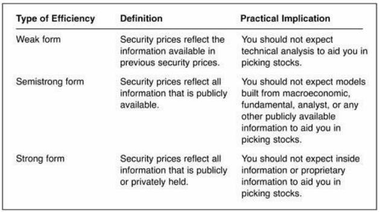

# 
 QEPM 的基本原理

## 一、alpha 的种类

> Colloquial（口头上的）meaning of $α$ is **outperformance**. In general, $α$ represents the **excess return** of the portfolio over the return of a reference insturment. In QEPM, $α$ is a measure of the **risk-sdjusted excess return**, which is the portfolio's performance after accounting for its risk relative to the reference instrument.

在 QEPM 模型中，增加 $α$ 其实意味着在没有增加对参考工具的风险暴露情况下，增加投资组合的收益。对于不同的参考工具，可以将 $α$ 分为不同的类型：

1. 当参考工具为**证券投资经理的基准（portfolio manager's benchmark）** 时，可将 $α$ 称为 **基准 $α$** , 记为 **$α^{B}$**。

2. 当参考工具为**一系列多因子基准（a series of multifactor benchmarks）** 时，可将 $α$ 称为**多因子 $α$** , 记为 **$α^{MF}$**。

3. 当参考工具为**市场投资组合（market portfolio）** 时，可将 $α$ 称为**CAPM $α$** , 记为 **$α^{CAPM}$**。

## 二、投资组合收益分解

考虑到参考工具的收益，可以将投资组合收益分解成2部分：

1. 一部分是与参考工具有关的收益，可被称为**预期收益（expected return）** 或是 **一致收益 （consensus return）** ;

2. 另一部分是与参考工具无关的收益，可被称为**剩余收益（residual return）** 或是 **模型无法解释的收益（the return not explained by the model）** 。

对于上面提到的3种不同的$α$，对于投资组合的收益有各自不同的分解方式。

### 2.1 Benchmark $α$

> $r_{p} = α + \beta r_{B} + \varepsilon$

其中，$r_{p}$ 为投资组合收益率，$r_{B}$ 为基准收益率。

1. $\beta r_{B}$ 就是和基准相关的预期收益；

2. $ α+\varepsilon$ 是模型无法解释的剩余收益，其中，**Benchmark $α$ 是对剩余收益的期望值**，$ \varepsilon$ 是剩余收益对其均值的偏离（deviation）。

3. **基准$α$（$α^{B}$）的特殊意义为：它是风险调整后，超越基准的超额收益。（It is the risk-adjusted excess return over the benchmark.）**

### 2.2 CAPM $α$

> $r_{p} = α + \beta r_{M} + \varepsilon$

其中，$r_{p}$ 为投资组合收益率，$r_{M}$ 为市场收益率。

1. $\beta r_{M}$ 就是和市场相关的预期收益；

2. $ α+\varepsilon$ 是模型无法解释的剩余收益，其中，**CAPM $α$ 来自资本资产定价模型CAPM**。在CAPM模型中，CAPM $α$ 应该等于0。若CAPM $α$为正，则获得了风险调整后的超额收益；

3. **CAPM$α$（$α^{CAPM}$）的特殊意义为：它是风险调整后，超越市场的超额收益。（It is the risk-adjusted excess return over the market.）。**

### 2.3 Multifactor $α$

> $r_{p} = α + \beta_{1} f_{1} + ... + \beta_{K} f_{K} + \varepsilon$

其中，$r_{p}$ 为投资组合收益率，$f_{1},...,f_{K}$ 为一系列因子收益。

1. $\beta_{1} f_{1} + ... + \beta_{K} f_{K}$ 是来自股票收益多因子（如经济中潜在的风险因子）模型的预期收益；

2. $ α+\varepsilon$ 是模型无法解释的剩余收益；

3. **多因子$α$（$α^{MF}$）的特殊意义为：它是考虑多个解释变量的风险调整后的超额收益。（It is a measurement of risk-adjused excess return given multiple explanatory variables.）**

### 2.4 三种 $α$ 之间的关系

1. $α^{MF}$=$α^{CAPM}$，当市场收益是多因子模型中唯一的因子时；

2. $α^{B}$=$α^{CAPM}$，当以市场投资组合为基准时；

3. $α^{MF}$=$α^{B}$，当市场收益是多因子模型中唯一的因子，而且还是以市场投资组合为基准时；

4. 使用非有效的基准，投资组合的基准 $α$ 会高于投资组合的市场 $α$ ，即 $α^{B}$>$α^{CAPM}$。所以，在基于整个市场衡量投资组合表现时，组合的表现会被高估。

### 2.5 事前$α$（Ex-Ante）和事后$α$（Ex-Post）

> ex-ante $α$ 是期望得到的 $α$； ex-post $α$ 是已经实现的 $α$。投资管理者最指望的就是希望 ex-post $α$ 和 ex-ante $α$ 可以高度相关。

#### **信息比率（information ratio）**

> The information ratio adjusts $α$ for the portfolio's residual risk.

####1. The ex-ante IC

> $IR = \frac{\alpha ^{B}}{\omega }$

其中，$\alpha ^{B}$ 是组合管理者期望或预测的 $α$，$\omega$ 是预测的残差的标准偏差（standard deviation of the residual）。

+ 事前IC 衡量了每单位超越基准的超额风险对应的超越基准的预期超额收益；（the expected excess return over the benchmark per unit of excess risk over the benchmark.）

+ 事前IC 越高，我们期望的投资组合表现越好。

## 三、QEPM的七大原则（the seven tenets of QEPM）

> Tenet 1: Markets are mostly efficient;
> Tenet 2: Pure arbitrage opportunities do not exist;
> Tenet 3: Quantitative analysis creates statistical arbitrage opportunities;
> Tenet 4: Quantitative analysis combines all the available information in an efficient way;
> Tenet 5: Quantitative models should reflect **persistent and stable** patterns;
> Tenet 6: Deviations of a portfolio from the benchmark are justified（合理的） only if the uncertainty is small enough.

### 3.1 有效资本市场与 QEPM 的关系

#### （1）有效资本市场假说（Tenet 1-2）

> 在有效市场中，市场上所有的信息都表现在股票当前的价格上。有效资本市场假说的基本理论将市场分为三种形式的有效市场，即弱式（weak-form）、半强式（semistrong-form）和强式有效市场（strong）.

##### 1. 弱式有效市场

**定义：** 在弱式有效的情况下,市场价格仅充分反应出所有过去历史的证券价格信息,包括股票的成交价,成交量,卖空金额,融资金融等；
（过去的股票价格无法为投资者提供任何可行的信息）

**推论：** 如果弱式有效市场假说成立,则股票价格的技术分析失去作用（因为技术分析就是通过从股票过去的价格、成交量等数据中提取股价变动的规律，如动量Momentum，而且大多数技术策略无法长期有效）,基本面分析还可能帮助投资者获得超额利润。 

**技术分析定义：** 通过图表或统计技术来分析市场行为并预测未来股价趋势。

##### 2. 半强式有效市场假说 

**定义：** 该假说认为价格已充分反应出所有已公开可用的信息（public information）.这些信息有成交价,成交量,盈利资料,盈利预测值,公司管理状况及其它公开披露的财务信息等.假如投资者能迅速获得这些信息,股价应迅速作出反应。

**推论:** 如果半强式有效假说成立,则在市场中利用技术分析和基本分析都失去作用（因为投资者无法用可获取的公开信息挑选股票并获得风险调整后的超额收益，只要新信息一公开，股价就会立马做出调整），内幕消息（nonpublic information）可能获得超额利润。

##### 3. 强式有效市场假说 

**定义：** 强式有效市场假说认为价格已充分地反应了所有关于公司营运的信息,这些信息包括已公开的或内部未公开的信息。

**推论:** 在强式有效市场中,没有任何方法能帮助投资者获得超额利润,即使基金和有内幕消息者也一样。

法律如果无法有效禁止内部信息的交易行为，那市场就不会是强式有效市场。

##### 4. 主动管理的前提条件

> The entire premise of active management, including QEPM, is that there are market inefficiencies prevalent and predictable enough to
exploit consistently for high returns.

抵效市场普遍存在并且可以预测，并足以用来持续开发以获得高额收益。

#### （2）异象

异象对市场有效性假说提出了重大挑战，投资者习惯性地没有考虑和正确解释与投资决策相关的所有信息，或者体制障碍阻止他们对某些信息采取行动，或者，即使所有相关信息都盯着他们，他们仍然坚持 做出非理性的选择，进而产生异象。

##### 1. 与弱势有效市场假说相违背的异象

+ **Momentum（动量）**：若股票收益在一段时间内存在显著的**正自相关性**，那过去一段时间内表现较好，能取得正收益的股票，在未来一段时间内继续表现较好，并获取正收益，反之亦然。（需注意动量因子的持续性）

##### 2. 与半强式有效市场假说相违背的异象

+ **Earnings surprise anomaly（超预期盈利异象）：** 当公司的盈利高于投资者对公司收益的一致预测（consensus estimate）时（即公司盈利与预测不符时），在相关信息公布之后，股价调整不会瞬间完成，而是会持续一段时间，股价对该信息的反应较为缓慢。有研究表明，在信息公布后，能持续获得13-26周的超额收益。

+ **January effect（一月效应）：** 小盘股和上年表现不佳的股票在 1 月份表现良好，尤其是在第一周。解释：A. 12 月份的税收损失会给投资者带来损失，抵消资产收益，所以 12 月的抛售使这些股票的价格跌至低于其实际非税价格的水平，新的一年来临后，投资者会回购这些股票，进而导致股票在一月份表现良好的现象；B. 基金经理会在年底卖出亏损股票，以符合 SEC（美国证券交易委员会） 的报告要求，这种做法被称为是橱窗装饰（window dressing）。

+ **其他日历效应（calender effect）：** 星期一效应（Monday effect），即股价在周一会有轻微下跌的趋势；夏令时效应（daylight savings effect ），即市场倾向于在夏令时开始后的第一个交易日小幅下跌，这可能是因为交易者的昼夜节律的破坏增加了他们对风险的厌恶情绪。

+ **与基本面数据相关的异象**：
   1. 具有低市净率（P/B ratio）或低市盈率（P/E ratio）的股票投资组合将获得高风险调整后的回报；
   2. 小市值股票比大市值股票能获得更高的风险调整收益，即被忽略的公司效应（neglected-firm effect）：分析师覆盖率较低或机构所有权较低的公司往往具有较高的风险调整后收益。因为大公司和小公司公开信息量存在差异，这种差异本身就是一种二级信息，而这种信息并未反应在股价中，使得市场非有效。

##### 3. 违背强势有效市场假说的相关测试

+ 内幕交易者测试（insider-traders test）：与其他外部人士相比，公司高管和其他内部人士对公司的运营和财务状况有更好的了解，因为内部消息不会立刻反映在股票上（Insider information is not
immediately priced into stocks）。

+ 专家测试（specialists test）：证券交易专家能访问限价订单，这等同于拥有私人信息，因为它包含潜在买卖双方准备购买或出售股票的价格。若专家利用这些信息进行投资，并获得超额收益，就引起了市场的非有效性。

